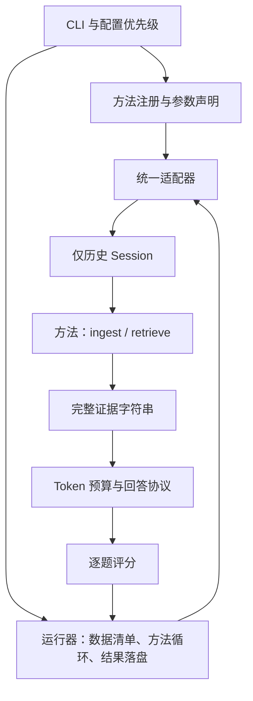

# 论文实验框架的模块边界与扩展约定

审查日期：2026-10-05。目标是支持新增记忆机制和可审计的 baseline 比较，而不是声称所有
原生第三方系统都采用相同协议或已经严格复现论文。新的研究方法优先走统一方法接口。

## 主执行路径



方法不接收参考答案，不承担回答和评分；统一适配器不进入方法内部修改记忆。
每段 conversation 创建独立后端，先完成历史写入，再执行问答，退出时释放拥有的资源。
`agents_memory` 保存 MemEval 数据/评分/原生适配器，`langmem_eval` 保存统一协议与新方法接口；
这两层已有稳定边界，无需为目录数量而再次混合源码。

## 本轮发现和修正

| 目标 | 原有问题 | 当前实现与验收 |
| --- | --- | --- |
| 可扩展 | 新参数需要编辑公共 ENV_FLAGS 和 runner 中的 A-Mem 特判 | MethodOption 与 public_config 在方法包注册；模板复制后直接接入 CLI/.env/完整评测；见 test_architecture.py |
| 低耦合 | 导入评分帮助模块会导入所有原生系统，触发可选 SDK 和全局补丁 | 原生系统按选择延迟加载；统一评分直接依赖公共评分模块；子进程导入守卫检查 |
| 可维护 | A-Mem 的 API、JSON 策略、图更新、日志和状态提交交错 | clients / responses / evolution / backend 分工；纯演化函数只返回候选状态与诊断数据 |
| 可读性 | 凭 Schema 字典相等推断解析阶段，新方法重复 JSON 解码 | 显式 purpose 与 Session.turns()；必要字段错误带路径 |
| 资源生命周期 | 每段对话创建客户端，没有统一释放钩子 | 可选 close()，managed_backend 保留原错误；构造失败用 ExitStack 释放已创建资源 |
| 实验审计 | 方法设置可能只有回答 trace 中有，写入失败时缺失 | 注册配置回调在调用模型前验证；config.method_settings 不依赖问答成功 |
| 复用 | A-Mem 和 LangMem 的向量返回校验不同 | 共用 validate_vectors，支持本地/API embedding；LangMem 用公开 dimensions 属性 |

## 新记忆机制放在哪里

从 `examples/method_template` 复制到 `src/langmem_eval/methods/my_method`，方法包自己管理：

```text
my_method/
  __init__.py       # 轻量注册、参数绑定、公开配置回调
  config.py         # 有默认值和校验的 settings
  backend.py        # 每段对话状态、ingest、retrieve、可选 close
  ...              # 根据实际复杂度添加纯算法、提示词或客户端模块
```

模板的 `--my-method-window` / `MY_METHOD_WINDOW` 是可运行的配置示例，近期历史选择只是教学算法。
研究概率状态、信息价值或记忆更新策略时，把状态转移写成纯函数，输入当前状态和新证据，
返回候选状态；模型调用与存储提交放在 backend。不要通过继承并覆写 A-Mem 私有方法构建新机制。
如果确实研究 A-Mem 变体，可以显式组合它的 `apply_evolution`，并使用新的注册名和实现版本。

可复用的接口：

- `interfaces.Session`：历史聊天消息与 `turns()` 的类型化读取；`HistoricalTurn` 保留说话人、时间、来源。
- `registry.register_method` / `MethodOption`：工厂、算法说明、CLI/env 绑定和无模型的配置审计。
- `embeddings.create_embedder` / `validate_vectors`：embedding 路由及向量有效性检查。
- `agents_memory.diagnostics.event/stage`：阶段与进度；不要在纯算法里打印提示词和响应全文。
- `agents_memory.usage.phase/record_external_usage`：记录阶段与未被 SDK 自动观察的成本。
- `backend.describe()` / `last_retrieval`：方法版本、参数、诊断和检索轨迹，可 JSON 序列化且不包含密钥。

`retrieve()` 返回排序后的完整证据，限额表示证据条数。图方法可把种子及关联记忆作为一条组证据，
但必须在 describe 中声明；共享预算不会截断字符串，也不会假定不同分组策略完全等价。
模型、embedding 和 settings 可注入构造器；注入资源由调用方关闭，后端只关闭自己创建的资源。

## 保持实验含义稳定

- 新方法采用新注册名，算法行为变化更新实现版本。代码整理本身不应修改提示词、预算或数据选择。
- A-Mem v4 的非候选链接过滤属于明确记录的适配差异；原版并不执行这种过滤。
- 原生系统结果标记为 native，可能有独立回答和检索协议；统一方法结果标记为 unified。
- 所有方法使用同一个冻结题目清单。失败计入固定分母，coverage 和 incomplete 必须随分数一起报告。
- 方法运行顺序和配置优先级仍是显式实验条件。当前 CLI 临时覆盖进程环境，只支持顺序执行；
  并行实验使用独立进程和输出目录。需要同进程并发时，应另行设计不可变运行上下文。
- 当前没有持久化断点恢复或通用训练循环；AML 服务的持久化生命周期与离线 benchmark 分开。
  这些是功能边界，不应在论文中声称已经支持。可在新方法包中加入训练/状态存取组件，
  但训练数据与测试题答案的隔离仍须单独验证。
- 成本报告只覆盖被观察到的调用，仍标记 partial；不声称捕获所有远程服务内部开销。

## 验证入口与证据范围

```bash
# 仅使用脚本化模型和向量；脚本屏蔽真实密钥与 .env。
uv run --locked --extra dev python scripts/verify_amem.py
uv run --locked --extra dev python scripts/verify_amem.py --guard

# 本机缓存已具备构建依赖时，验证可分发安装包。
uv build --offline --wheel
```

测试覆盖：新方法复制注册、参数来源/恢复、结果记录、状态隔离、参考答案隔离、懒加载、
资源释放、纯状态转移不修改输入、A-Mem 行为与容错、真实 LangMem SDK 假模型存储、固定分母、
Token 预算、阶段成本、AML 隔离、日志/进度，以及 wheel 在仓库外导入并显示 CLI 帮助。
这些测试证明工程边界和行为，不证明真实模型准确率、供应商兼容性或论文结论；正式实验仍需
固定数据版本、模型版本和配置，并运行多次实验及消融。

`tests/conftest.py` 默认禁用真实 .env 和外部 socket 连接，仅允许本地事件循环所需的 loopback。
测试使用 fake SDK 或 MockTransport，不通过 loopback 调用真实推理服务。

本轮完成审查的验证记录（2026-10-05）：A-Mem 行为验收 10/10 通过，其他离线回归
136/136 通过；离线 wheel 构建成功，并通过仓库外导入/CLI 检查；`git diff --check` 通过。
运行中仅剩 Starlette/AnyIO 的第三方弃用警告，没有模型 API 调用、权重下载或在线 benchmark。
这份记录对应本轮工作区修改，后续改变算法或接口后需要重新运行上述命令。
