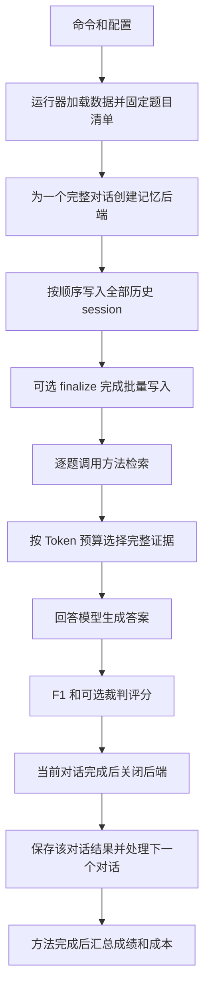

# LangMemEval 源码阅读教程

这份教程面向准备使用本仓库复现 baseline、实现新记忆机制并开展论文实验的读者。目标是让你能够沿着一次运行找到实际执行的函数，理解状态如何改变，区分算法问题和评测问题，并独立接入自己的方法。

本文依据 2026 年 10 月 5 日、基准提交 `5a422c1` 之后完成统一方法接口迁移的工作区代码编写。A-Mem 实现标识为 `amem_original_json_unified_v4`。代码中的默认值、接口和容错行为以实际检出的版本为准；这里没有给出模型速度、准确率或论文分数的实测结论。

文中的源码链接相对于本文所在目录，可以在 GitHub 和本地编辑器中打开。命令默认在 Linux Bash 中、仓库根目录执行，例如矩池云的 `/mnt/LangMemEval`。标注为“伪代码”的片段用于解释流程；只有练习中的完整命令供直接执行。

## 阅读路线

第一次阅读，建议按下面的顺序分三轮完成，不必同时读懂所有 SDK。

| 阅读轮次 | 先读本教程 | 对照源码 | 应该能回答的问题 |
| --- | --- | --- | --- |
| 第一轮 | 运行入口、配置、输入数据、接口、统一适配器 | `cli.py`、`interfaces.py`、`adapter.py` | 谁创建记忆，谁检索，谁回答，谁评分？ |
| 第二轮 | A-Mem 写入、演化、检索、模型边界 | `methods/amem/` | 一条新消息怎样改变已有记忆？ |
| 第三轮 | 结果、成本、新方法、离线练习 | `experiment.py`、模板、测试 | 怎样修改方法并确认没有破坏实验？ |

全文导航：

- [工程分工](#工程分工)
- [从命令追踪程序入口](#从命令追踪程序入口)
- [配置如何进入方法](#配置如何进入方法)
- [输入数据与记忆生命周期](#输入数据与记忆生命周期)
- [方法接口和注册机制](#方法接口和注册机制)
- [统一适配器如何完成评测](#统一适配器如何完成评测)
- [逐步阅读 A-Mem](#逐步阅读-a-mem)
- [LangMem 后端的另一条实现路径](#langmem-后端的另一条实现路径)
- [聊天模型和嵌入模型的边界](#聊天模型和嵌入模型的边界)
- [评分与失败如何影响实验](#评分与失败如何影响实验)
- [日志和结果文件怎么读](#日志和结果文件怎么读)
- [成本统计能说明什么](#成本统计能说明什么)
- [怎样加入自己的记忆机制](#怎样加入自己的记忆机制)
- [不调用真实模型的阅读练习](#不调用真实模型的阅读练习)
- [修改后怎样验证](#修改后怎样验证)
- [排错顺序与阅读自测](#排错顺序与阅读自测)

## 工程分工

本仓库把“记忆算法”和“实验过程”分开。记忆算法处理历史和问题，返回证据；实验过程负责把证据交给回答模型，再将答案与参考答案比较。



源码中的两个主要 Python 包各有职责：

```text
src/
├── langmem_eval/
│   ├── cli.py                 命令入口
│   ├── configuration.py       配置优先级和共享模型配置
│   ├── registry.py            方法注册、发现、创建
│   ├── interfaces.py          Session 和 MemoryBackend 接口
│   ├── adapter.py             统一的写入、检索、回答流程
│   ├── benchmark.py           历史转换和完整证据预算选择
│   ├── protocol.py            回答提示词及预算
│   ├── evaluation.py          逐题执行和调用评分函数
│   ├── embeddings.py          本地和 API 嵌入客户端
│   ├── model_api.py           API 地址和附加请求选项
│   ├── llm_diagnostics.py     聊天请求诊断
│   ├── lifecycle.py           后端资源释放
│   ├── methods/               所有 baseline 和新方法，唯一接入位置
│   └── aml/                   AML 服务接口和持久化逻辑
└── agents_memory/
    ├── runner.py              实验循环与结果保存
    ├── benchmarks/            数据集接入
    ├── evaluation.py          F1 和裁判评分函数
    ├── experiment.py          清单、结果归一化、失败和汇总
    ├── diagnostics.py         阶段日志和等待心跳
    ├── console_progress.py    终端进度
    └── usage.py               分阶段用量统计
```

`langmem_eval` 是项目自己的整合包，`langmem` 是它使用的第三方依赖。二者名字相似，但不是同一个包。执行 A-Mem 时不会先经过 LangMem 的记忆算法，两个方法是并列的。

现在只有一种方法接入方式：所有 baseline 都在 `langmem_eval/methods/` 注册，提供 `ingest/retrieve`，共用 `adapter.py` 和 `AnswerProtocol`。旧 `agents_memory/systems/` 执行入口已删除。

当前只内置 A-Mem 和 LangMem。新结果的 `adapter_protocol` 都为 `unified_v1`。以前保存的 `native` 结果仍是旧协议，不能直接当成本轮重跑结果。

A-Mem 和 LangMem 的记忆构建算法各自实现，共用回答与评测流程。其他研究方法需要明确选定后再复现；本框架只预留注册接口和教学模板，见 [统一方法说明](unified-methods.md)。

普通离线 benchmark 不经过 `aml/`。`langmem-aml` 是另一条服务入口，其配置和存储生命周期也不同；实现了 `ingest/retrieve` 不代表自动完成 AML 服务接入。服务部分另见 [AML 指南](aml.md)。

## 从命令追踪程序入口

以已经准备好环境和模型配置后的真实调用为例。这个命令会调用模型，阅读阶段不必执行：

```bash
uv run --extra amem langmem-eval \
  --systems amem \
  --benchmark locomo \
  --protocol locomo \
  --data-file examples/amem_smoke.json \
  --num-samples 1 \
  --skip-judge \
  --output-dir results/amem-reading
```

| 命令部分 | 含义 |
| --- | --- |
| `uv run` | 使用 uv 管理的项目环境执行后面的程序 |
| `--extra amem` | 为运行准备 A-Mem 的可选依赖，不负责选择算法 |
| `langmem-eval` | Python 项目注册的可执行命令 |
| `--systems amem` | 选择实际运行的记忆方法 |
| `--benchmark locomo` | 选择数据集适配、类别和评分分支 |
| `--protocol locomo` | 选择统一回答器的默认配置，不是论文原版协议的保证 |
| `--data-file` | 从指定本地 JSON 读取已归一化的数据 |
| `--num-samples 1` | 选择一个完整 conversation 样本 |
| `--skip-judge` | 不调用评分裁判；仍进行记忆处理和回答 |

入口注册在 [pyproject.toml](../pyproject.toml)：

```toml
[project.scripts]
langmem-eval = "langmem_eval.cli:main"
langmem-aml = "langmem_eval.aml.app:main"
```

冒号左边是模块，右边是函数。沿着 [cli.main](../src/langmem_eval/cli.py) 往下追踪，会进入 [runner.main](../src/agents_memory/runner.py)。前者还单独处理 `--list-methods`，后者负责普通评测。

`runner.main()` 的关键顺序是：

```python
# 伪代码，省略错误处理和部分参数
args = parse_args()
with configured_environment(args):
    if args.show_config:
        显示最终配置
    else:
        创建输出目录和本次运行编号
        with run_logging(日志路径):
            _run(args)
```

然后读 `_run()`，先关注这些搜索词：`freeze_manifest`、`for name in system_names`、`for index, conv`、`info["fn"]`、`normalize_results`、`compute_summary`。暂时不展开模型 SDK，你就能看清整个实验的循环边界。

多个方法按顺序运行，每个方法使用该次运行冻结的同一组样本。当前框架没有把这些循环改成同进程并发任务。

## 配置如何进入方法

打开 [configuration.py](../src/langmem_eval/configuration.py)，先读 `ENV_FLAGS`，再读 `configured_environment()`。

当前明确的优先级为：

```text
命令行参数 > .env 文件 > 进程环境变量 > Settings 默认值
```

例如 `.env` 设置 `EMBEDDING_DEVICE=cuda`，但命令传入 `--embedding-device cpu`，后端最终读到的是 `cpu`。如果只在终端 `export EMBEDDING_DEVICE=cpu`，而 `.env` 仍然写着 `cuda`，则文件中的值会覆盖终端变量。

配置解析不是让所有代码自己反复读取 `.env`。统一入口先收集已声明的配置键，将合并后的结果临时写入 `os.environ`；方法再调用自己的 `Settings.from_env()`。实验作用域退出时，原来的环境值会恢复。

因此看到下面一行时，不要误认为命令行设置被忽略了：

```python
self.settings = AMemSettings.from_env()
```

读这行之前，要先确认调用栈是否经过 `configured_environment()`。直接在自己的 Python 脚本里构造后端，不会自动运行 CLI 的 `.env` 合并流程；测试和独立脚本通常显式传入 settings。

几组常用参数分别负责不同阶段：

| 配置类别 | 命令行例子 | 环境变量例子 | 消费者 |
| --- | --- | --- | --- |
| 聊天模型 | `--llm-model` | `LLM_MODEL` | A-Mem 控制器和最终回答器 |
| 聊天地址 | `--llm-base-url` | `OPENAI_BASE_URL` | 聊天客户端 |
| 嵌入模型 | `--embedding-model` | `EMBEDDING_MODEL` | 共享 embedder |
| 嵌入设备 | `--embedding-device` | `EMBEDDING_DEVICE` | 本地 SentenceTransformer |
| 写入邻居数 | `--amem-neighbor-k` | `AMEM_NEIGHBOR_K` | A-Mem 写入 |
| 方法输出预算 | `--amem-max-output-tokens` | `AMEM_MAX_OUTPUT_TOKENS` | A-Mem 分析、演化、查询生成 |
| 检索证据数量 | `--top-k` | `EVAL_TOP_K` | 统一检索入口 |
| 证据 Token 预算 | `--context-tokens` | `EVAL_CONTEXT_TOKENS` | 证据选择 |
| 答案输出预算 | `--max-output-tokens` | `EVAL_MAX_OUTPUT_TOKENS` | 最终回答器 |
| 终端日志模式 | `--log-mode` | `EVAL_LOG_MODE` | 日志输出 |

密钥使用对应的 `OPENAI_API_KEY` 和 `EMBEDDING_API_KEY`。不要将真实密钥写入 Python 源码、教程或提交记录。

默认 `.env` 路径是当前工作目录下的 `.env`，可用 `--env-file` 指定其他文件。不是文件里的每个任意键都会被统一解析器使用：新方法的环境变量应通过 `MethodOption` 注册。诸如 `UV_PROJECT_ENVIRONMENT` 的工具环境变量应在 shell 中设置，不能指望程序启动后读取 `.env` 再改变 uv 的环境选择。

已安装好环境后，可以先运行：

```bash
uv run --locked --no-sync langmem-eval --systems amem --show-config
```

重点检查输出中的 `models`、`answer_protocol`、`methods.amem` 和 `sources`。这个 A-Mem 配置检查不创建后端，不下载嵌入权重，也不调用模型。完整参数表见 [统一配置说明](configuration.md)。

## 输入数据与记忆生命周期

先打开小数据集 [examples/amem_smoke.json](../examples/amem_smoke.json)。它有一个 conversation，包含两个 session、三条历史发言和两道问题：

```text
conversation 样本 amem-smoke-1
├── session_1  2025-01-01
│   ├── Alice  I live in Berlin.
│   └── Bob    My favorite drink is coffee.
├── session_2  2025-02-01
│   └── Alice  I moved from Berlin to Shanghai today.
└── qa
    ├── Where does Alice live now?       参考答案 Shanghai
    └── What is Bob's favorite drink?    参考答案 coffee
```

三个层级要分清：

| 名称 | 当前代码中的含义 | 是否新建后端 |
| --- | --- | --- |
| conversation | 一个完整评测样本，含历史和 QA | 是 |
| session | 样本内部的一段历史聊天 | 否，沿用当前样本的后端 |
| turn/message | session 中的一条历史发言 | 否 |

所以 `--num-samples 1` 可以包含几百条发言和上百道题。A-Mem 按发言构建 note；LangMem 后端把整个 session 交给 SDK 处理。接口相同并不意味着写入粒度相同。

[benchmark.extract_sessions()](../src/langmem_eval/benchmark.py) 按 `session_1`、`session_2` 的数字顺序取历史，把每条发言转换为：

```python
{
    "role": "user",
    "content": '{"speaker":"Alice","text":"I live in Berlin.",'
               '"date":"2025-01-01","source_id":"s1:1"}'
}
```

这里 `content` 是一段 JSON 字符串。所有历史说话人都作为被引用的历史数据传入，真实说话人身份保存在 `speaker` 字段，而不是把其中一人设置成回答模型的 assistant 角色。

[Session.turns()](../src/langmem_eval/interfaces.py) 将它解码为 `HistoricalTurn`，提供 `speaker`、`text`、`date` 和 `source_id`。新算法通常用这个接口，避免重复编写 JSON 解码逻辑。

`build_memory()` 只传 `Session`，不会把 `qa` 中的参考答案交给记忆后端。先写完当前 conversation 的所有历史，再评测它的全部问题。这不是“聊天一条、立即回答一道题”的交错流程。

每个新 conversation 会重新创建后端。A-Mem 的 `notes` 和 `vectors` 在实例内，LangMem 使用独立 namespace；不会把前一个样本的记忆当作后一个样本的历史。统一适配器也不会自动把评测问题或预测答案写回记忆。

通过 `--data-file` 直接读取的文件需要已经符合本框架的归一化结构。`--benchmark` 不会把任意本地 JSON 自动转换成这种结构；其他原始数据格式需要先经对应适配器转换。

## 方法接口和注册机制

先读 [interfaces.MemoryBackend](../src/langmem_eval/interfaces.py)：

```python
class MemoryBackend(Protocol):
    def ingest(self, session: Session) -> None: ...
    def retrieve(self, query: str, limit: int) -> list[str]: ...
```

`Protocol` 描述对象需要具备的行为。你的类不需要继承 A-Mem 或特定框架基类，提供这两个方法即可。

- `ingest` 写入一段历史，或者由批量方法暂存这段历史。
- 可选 `finalize()` 在全部 `ingest` 后调用一次；批量方法必须在返回前完成实际写入。没有此钩子的方法必须在 `ingest` 中同步完成写入。
- 可选 `restore_cached_memory(sessions)` / `save_cached_memory(sessions)` 必须成对提供。加载命中时跳过 ingest/finalize；未命中时只在完整写入成功后、QA 前保存。A-Mem 已实现，默认关闭。
- `retrieve` 返回排序后的完整证据字符串，最多 `limit` 条。它不返回最终答案。
- 可选 `describe()` 返回版本、参数和诊断，必须能序列化成 JSON，不能含密钥。
- 可选 `last_retrieval` 暴露最近一次检索轨迹。
- 可选 `close()` 释放后端自己创建的资源。

注册在 [methods/amem/__init__.py](../src/langmem_eval/methods/amem/__init__.py)。下面保留其核心结构，省略具体参数声明：

```python
@register_method("amem", architecture="...", infrastructure="...")
def create(model):
    from .backend import AMemBackend
    return AMemBackend(model)
```

装饰器执行时把工厂记到注册表，不会立即调用工厂创建模型。函数内的导入用于推迟加载算法及可选依赖。这个设计使“列出方法”和“查看帮助”不必先加载 torch 权重或所有 baseline SDK。

[registry.py](../src/langmem_eval/registry.py) 中三个函数负责发现、检查和创建：

```text
discover_methods()
    扫描 methods 下公开模块和子包，导入注册入口

create_backend(name, model)
    找到工厂，创建后端，检查 ingest/retrieve 是否存在

check_dependencies(name, method)
    检查所选方法声明的可选 SDK，缺少时提示安装对应 extra
```

运行器直接调用 `run_method(name, conv, ...)`，例如 `run_method("amem", conv, ...)`；不再经过另一套 `SYSTEMS` 字典或函数包装层。

列方法、帮助和 `--show-config` 不要求安装全部 SDK。真实运行先检查所选方法的依赖，再加载数据和模型。初学时明确传 `--systems amem`；`all` 包含全部已注册方法，需要相应依赖、服务或训练权重。

## 统一适配器如何完成评测

[adapter.py](../src/langmem_eval/adapter.py) 很适合精读：它是方法与评测之间的主要边界。

```python
# 对真实代码的简化说明
backend = create_backend(method, llm_model)
with managed_backend(backend):
    build_memory(conv, backend)  # 按序 ingest，然后调用可选 finalize

    def answer(question):
        records = backend.retrieve(question, top_k)
        selection = select_context(records, max_tokens=context_tokens)
        if 没有证据且协议要求弃答:
            return abstention_text
        messages = protocol.messages(question, selection.context)
        return 调用回答模型(messages)

    return evaluate_questions(conv, answer, ...)
```

内部的 `answer()` 是一个闭包：它能使用外层创建的 `backend` 和 `protocol`。评测器只传问题，具体如何检索和调用回答模型由这个闭包封装。

`answer.trace` 是挂在函数对象上的属性。每次回答先清空，再记录协议、上下文、实际 messages、是否调用回答模型及失败阶段。评测器使用 `deepcopy` 保存每道题的快照，避免后一题覆盖前一题的记录。

### 证据预算

[benchmark.select_context()](../src/langmem_eval/benchmark.py) 依次尝试将证据放入上下文。超出预算的一条会被整体跳过，后面的短证据仍可能被选入。Token 数对包括分隔符在内的实际拼接文本重新计算，不是简单地加各条长度。

示意：预算 100，首条放入后，第二条放不下，第三条仍可能放下。算法不会截取第二条的一半。

这个预算只覆盖证据上下文，不包括 system prompt、问题、消息封装和模型输出。默认 `cl100k_base` 是实验采用的计数口径，不能当作所有供应商的精确计费 tokenizer。不同模型比较时应明确报告这项设置。

### 回答协议

[protocol.AnswerProtocol](../src/langmem_eval/protocol.py) 负责提示词和答案参数。当前默认值包括：

| 参数 | 默认值 |
| --- | --- |
| `top_k` | 20 |
| `context_tokens` | 6000 |
| `tokenizer` | `cl100k_base` |
| LoCoMo 答案输出预算 | 256 |
| LongMemEval 答案输出预算 | 512 |
| 回答 temperature | 0.1 |
| 空上下文策略 | `abstain` |
| 弃答文本 | 字符串 `None` |

这里的 `None` 是预测文本，不是 Python 的空值。空上下文按策略弃答通常仍算一次成功执行的回答，是否正确由评分决定；不会因此自动标成程序错误。

`--protocol auto` 根据所选 benchmark 的评分分支选择默认回答协议。这些是框架的实验默认值，不应描述为已经严格复现各论文的全部评测协议。

### 资源释放

[lifecycle.managed_backend()](../src/langmem_eval/lifecycle.py) 在成功或异常退出后调用可选的 `close()`。构造时注入的测试模型或共享客户端由调用方管理，后端只关闭自己创建的资源。清理期间再次出错时，代码尽量保留原来的主要异常。

## 逐步阅读 A-Mem

建议按 `memory.py → backend.py → evolution.py → responses.py → clients.py → prompts.py` 阅读。先看数据，再看控制流程，最后看模型提示词。

### 一条记忆存了什么

[memory.Note](../src/langmem_eval/methods/amem/memory.py) 是 dataclass：

```python
@dataclass
class Note:
    id: str
    source_id: str
    session_id: str
    timestamp: str
    content: str
    keywords: list[str]
    context: str
    tags: list[str]
    links: list[str]
```

`id` 是内部唯一标识，`source_id` 用来追溯原始发言。`content` 保存带说话人标记的历史文本；`context` 是模型生成的语义描述，不是最终回答器的全部上下文。`links` 保存其他 note 的内部 ID。

`indexed_text()` 决定送给 embedding 的文本，`record()` 决定检索结果里呈现给回答器的文本。改变其中任何一个都可能改变实验行为，不能把格式变更一概当作无影响的整理。

后端维护两份对应状态：

```text
notes[0]   ↔ vectors[0]
notes[1]   ↔ vectors[1]
...
```

如果有 N 条记忆、每条向量 D 维，`vectors.shape` 是 `(N, D)`。存储顺序、索引和链接含义必须保持一致。

### 写入一条新发言

[AMemBackend.ingest()](../src/langmem_eval/methods/amem/backend.py) 遍历 `session.turns()`，每条调用 `_add_note()`。对 `_add_note()` 逐段阅读：

1. `amem.analyze`：调用分析提示词，生成 `keywords/context/tags`，构造新 Note。
2. `amem.neighbors`：使用原始发言内容查询已有向量索引，得到最多 `neighbor_k` 个候选的全局索引。
3. `amem.evolve`：把新 note 和候选邻居交给 LLM，获取演化决策。
4. `apply_evolution()`：在副本上应用决策，得到候选新记忆集合。
5. 计算新增向量，或在阈值条件满足时重建全部向量。
6. 全部向量操作成功后，将新的 notes、vectors 和演化计数一起赋回实例。

当前实现即使没有候选邻居，也会走一次演化调用。所以完整成功写入 N 条消息时，通常包含 N 次分析和 N 次演化聊天调用，此外还有 embedding。SDK 重试会使 HTTP 尝试数更多。

最后才提交状态的含义是：若新向量产生 NaN 或请求失败，已保存的 notes/vectors 不会被改到一半。为记录真实发生的事件，尝试次数和输出修正计数等诊断信息可能已经增加；它不是整个后端所有属性的事务回滚。

### 向量检索在做什么

`_search(query, k)` 先把 query 编码为向量，再计算余弦相似度：

```text
score_i = dot(memory_vector_i, query_vector)
          / (norm(memory_vector_i) * norm(query_vector))
```

然后逆序取相似度最高的 k 个全局索引。当前是 NumPy 对全部记忆做相似度计算，没有使用独立的近似最近邻向量数据库。实验规模扩大时，要把这一点纳入性能分析。

### 演化函数如何更新链接和邻居

[evolution.apply_evolution()](../src/langmem_eval/methods/amem/evolution.py) 是纯状态变换：它不调用模型、不读取全局配置、不直接输出日志。输入为已有 notes、新 note、演化决策、候选索引；输出为 `EvolutionUpdate`。

`EvolutionUpdate` 包含候选 notes、是否演化、诊断事件和修正计数。后端拿到诊断数据后统一写日志。这使算法可以独立于服务调用进行测试。

两个已知动作：

| 动作 | 修改内容 |
| --- | --- |
| `strengthen` | 给新 note 设置指向候选记忆的 links，并更新新 note 的 tags |
| `update_neighbor` | 按候选列表顺序更新旧 note 的 context 和 tags |

例如候选全局索引是 `[8, 2, 11]`，模型返回 `suggested_connections=[2, 99]`，只保留全局索引 2。不会把 2 解释成候选列表的第三项 11。写入 links 时，再把这个全局索引换成对应 note 的 ID。

这类链接从新 note 指向选中的已有 note，不会自动补上反向边。有效返回项的顺序和重复项也会保留。

邻居更新数组则按位置对应候选列表。其当前策略是：以候选数和 tags 数较小者作为更新数量；有对应 context 才替换 context，否则保留旧值；超出部分忽略。不能简单理解为“所有数组长度必须完全相同”，也不能认为这是一次按 ID 匹配的更新。

### 索引什么时候重建

[AMemSettings](../src/langmem_eval/methods/amem/config.py) 中默认 `evolution_threshold=100`。代码逻辑为：

```python
count = self.evolution_count + int(proposed.should_evolve)
if should_evolve and count % self.settings.evolution_threshold == 0:
    # 为全部候选新 notes 重新计算向量
else:
    # 仅计算新 note 的向量，并追加到旧矩阵
```

计数依据是 `should_evolve`，不是历史总消息数，也不是变化字段的数量。阈值不控制是否调用演化模型。

在两次重建之间，旧 note 的 context/tags 可能已经更新，而它在向量矩阵中的表示仍是之前的版本。这是当前实现保留的行为，对检索和消融实验有意义。

### 模型输出如何解析和容错

[clients.OpenAIController](../src/langmem_eval/methods/amem/clients.py) 负责发请求，`purpose` 明确指定 `analysis/evolution/query`。[responses.py](../src/langmem_eval/methods/amem/responses.py) 负责解析 JSON 和检查实际使用的字段；后端也会对注入控制器的返回结果应用同样的字段策略。

| 情况 | 当前行为 |
| --- | --- |
| 多余顶层字段 | 忽略并记录数量 |
| `should_evolve=false` | 不要求其余动作字段齐全 |
| 未知 action | 忽略，已知动作继续执行 |
| 非候选整数链接 | 过滤并记录，不终止当前写入 |
| 邻居更新数组长度不匹配 | 按上述位置前缀策略处理 |
| `finish_reason=length` 但返回了完整有效 JSON | 仍尝试解析并接受 |
| 演化阶段 JSON 无法解码 | 跳过演化，继续后续新 note 保存 |
| 分析或查询阶段 JSON 无法解码 | 抛错 |
| 执行动作需要的字段缺失或类型错误 | 抛错 |
| HTTP、认证、模型服务等异常 | 不当成普通 JSON 错误吞掉 |

`InvalidJSONResponse` 是专门区分 JSON 解码失败的异常类型。`_evolve()` 只降级这一类错误，不是捕获所有异常后继续。

结构化请求模式有 `json_schema`、`json_object`、`prompt`。本地的容错发生在收到响应之后；如果服务端拒绝请求格式，它不会自动被本地字段过滤修复。

本仓库使用固定来源提示词和已记录的适配策略。非候选链接过滤是本地适配差异，不应写成原版 A-Mem 也做了同样过滤。详细差异见 [A-Mem 指南](amem.md)。

### 回答一道问题前怎样检索

`retrieve(query, limit)` 的顺序为：

```text
原问题
  → LLM 生成关键词字符串
  → 关键词向量检索
  → 选取种子 notes
  → 每个种子展开直接 links
  → 返回证据组字符串
```

这里是一次关键词生成加一次向量检索，没有实现“LLM 检查缺什么再循环检索”的 ReAct 流程。链接展开也只读取种子的直接链接，不递归遍历整张图。

每个种子对应一个返回字符串，里面包含种子和最多 `limit` 个关联项；最多返回 `limit` 个组。`limit=20` 因而不等于最终只包含 20 条 note。组之间、链接列表内部都可能出现重复记忆；当前没有统一全局去重。

统一上下文选择器把整个组当作不可拆分的证据。若一个组太长，即使其中某条 note 有价值，整个组也会被跳过。因此对比方法时应同时报告证据组策略和 Token 预算。

A-Mem 的 `retrieve` 更新 `last_retrieval` 等诊断，但不演化或追加 notes。最终回答由适配器另外调用 LLM。

## LangMem 后端的另一条实现路径

打开 [methods/langmem/backend.py](../src/langmem_eval/methods/langmem/backend.py)。构造器主要创建共享 embedder、独立 namespace、`InMemoryStore`、聊天模型和 `create_memory_store_manager()`。

写入核心是：

```python
self.manager.invoke({"messages": session.messages})
```

检索核心是：

```python
items = self.store.search(self.namespace, query=query, limit=limit)
return [json.dumps(item.value, ensure_ascii=False) for item in items]
```

本仓库把记忆提取与更新交给 LangMem SDK，随后在 store 中检索。它的代码短是因为复用了第三方实现；A-Mem 则在本仓库显式实现 note 和图演化。

当前 LangMem API embedding 路径要求显式维度，因为 store 初始化时就需要知道向量尺寸。构造参数默认 `enable_deletes=False`、`query_limit=5`；这些 SDK 写入设置不能与统一评测的 `EVAL_TOP_K` 混为一谈，也不是所有构造参数都已有独立 CLI 开关。

## 聊天模型和嵌入模型的边界

[embeddings.create_embedder()](../src/langmem_eval/embeddings.py) 根据 `EMBEDDING_PROVIDER` 选择后端：

```text
local  → LocalEmbedder → SentenceTransformer
openai → APIEmbedder   → 兼容 OpenAI 的 embeddings 接口
```

这里 `openai` 表示接口兼容形式，不要求模型一定由 OpenAI 提供。聊天和 embedding 的地址、密钥、模型名分别配置，不会因为设置了聊天服务就自动拥有可用的 embedding 服务。

本地模型按模型名、revision、device、local_files_only 缓存，减少同进程反复加载。共享模型对象不等于共享 conversation 的记忆状态。

`validate_vectors()` 检查二维形状、数量、维度一致性、有限数值和非零范数。这些检查保护后续余弦相似度计算，不属于模型 JSON 的宽松处理策略。

聊天请求的附加配置经 [model_api.py](../src/langmem_eval/model_api.py) 处理，例如 `LLM_EXTRA_BODY`。A-Mem 自己的生成 temperature 默认是 0.7，统一回答器默认是 0.1；两者使用同一个模型名也不代表使用同一组生成参数。

## 评分与失败如何影响实验

沿着 [langmem_eval/evaluation.evaluate_questions()](../src/langmem_eval/evaluation.py) 可以看到每道题读取参考答案，但传给 `answer_fn` 的参数只有 question。参考答案在评分阶段使用，没有通过这个参数传给记忆或回答模型。

[agents_memory/evaluation.py](../src/agents_memory/evaluation.py) 提供 F1 和裁判函数。前一个 `evaluation.py` 负责循环与异常，后一个负责评分算法；它们名称相同但职责不同。

[experiment.freeze_manifest()](../src/agents_memory/experiment.py) 为样本和题目生成稳定的本次运行标识，例如 `c000000:q000000`，保留原始样本 ID，并记录数据和参考答案指纹。它固定了本次实验应完成哪些题。

`normalize_results()` 将返回结果映射回清单，对缺失项创建错误记录，并用规范参考答案重新计算 F1，避免只统计方法愿意返回的题。

| 错误位置 | 当前处理 |
| --- | --- |
| 后端初始化或历史写入 | 当前 conversation 全部 QA 标记失败，运行器继续其他 conversation |
| 单题检索或回答 | 当前题失败，继续后面的题 |
| 单题裁判 | 保留回答及其 F1，标记裁判失败 |
| 演化 JSON 被允许降级 | 记录跳过，不自动造成整段 conversation 失败 |

一条写入错误可以使一个 conversation 的 199 道题都变成 `stage=conversation` 的错误记录。它表示回答阶段没能开始，不表示发生了 199 次独立模型错误。

汇总中几个字段的区别：

| 字段 | 解读 |
| --- | --- |
| `answer_coverage` | 成功生成回答的题数占比，包括正常返回的弃答文本 |
| `coverage` | 完成全部要求的题数占比；启用裁判时还要求裁判成功 |
| `overall_f1_mean` | 先在每个 conversation 内平均，再对 conversation 平均 |
| `question_micro_f1` | 直接对全部问题 F1 平均 |
| `run_status` | 全部要求完成时为 complete，否则为 incomplete |
| `failure_counts` | 失败阶段计数 |

失败回答的 F1 按 0 计入固定分母。裁判失败不会抹掉已经得到的答案 F1，但使运行不完整。运行器完成保存后，如存在不完整方法会以退出码 2 结束。被强行中断的运行不保证生成最终汇总。

## 日志和结果文件怎么读

一次运行的文件共享一个 run tag，通常含 benchmark、模型名、UTC 时间戳和随机后缀。不要只按目录看结果，要核对 run tag，避免把两次运行的日志和 JSON 混在一起。

| 文件 | 用途 | 写入时机 |
| --- | --- | --- |
| `run_<tag>.log` | 阶段、耗时、请求、重试、异常堆栈 | 运行期间持续写入 |
| `manifest_<tag>.json` | 题目清单和数据指纹 | 模型实验开始前 |
| `<method>_<tag>_progress.jsonl` | 逐题结果，每行一个 JSON | 每完成一个 conversation 后追加并 flush |
| `<method>_<tag>_results.json` | 方法配置、汇总、成本、所有题结果 | 该方法循环结束 |
| `benchmark_summary_<tag>.json` | 多方法比较汇总 | 每完成一个方法后更新 |

`progress.jsonl` 不是逐条记忆保存文件，也不是每道题完成就立即落盘。代码目前没有读取它来自动恢复进度的逻辑。

A-Mem 另有可选的完整历史缓存：[methods/amem/cache.py](../src/langmem_eval/methods/amem/cache.py)。
它在 QA 前保存笔记、链接、实际向量矩阵、计数与摘要，不只保存 `snapshot()`；
加载不重算向量，保留延迟重建索引的行为。`--amem-cache-mode reuse` 构建并保存，
`require` 必须命中。它不恢复半途写入，也不恢复已答题进度。使用及失效规则见
[缓存指南](amem.md#复用已经构建的记忆避免重复写入)。

逐题阅读建议：

```text
evaluation_id
  → answer_status / judge_status / error
  → predicted / ground_truth / f1
  → answer_trace.retrieval_trace
  → answer_trace.selected_indices / dropped_indices / token_count
  → answer_trace.context
  → answer_trace.messages / answer_called
```

先判断“有没有正常执行”，再判断“找没找到证据”，最后判断“模型有没有正确利用证据”。不要直接从错误记录的 0 分推断记忆算法性能差。

结果文件保存了评测文本和实际回答上下文，但日志诊断不主动记录完整请求体、思考全文或所有 A-Mem 结构化响应。日志的“完整”指完整诊断级别，不是全部模型输入输出全文。

### 慢请求如何定位

[diagnostics.stage()](../src/agents_memory/diagnostics.py) 用上下文管理器记录阶段 start、done、failed 和耗时；后台心跳默认每 30 秒报告仍在运行的最内层阶段。

```text
stage="embedding.load"   等待嵌入模型构造完成
stage="llm.api"          等待一次聊天请求完成
status="llm.retry"       实际观察到了新的 HTTP 尝试
status="llm.response"    请求结束，包含长度和 usage
```

`waiting` 不代表重试、限流或死锁，只能定位尚未结束的阶段。诊断实现位于 [llm_diagnostics.py](../src/langmem_eval/llm_diagnostics.py)，用 `request_id` 关联同一次调用的事件。

`visible_output_chars` 和 `reasoning_chars` 是字符数，不是 Token 数。服务未返回可观测的推理文本时，长度可以是 null；不能据此断言服务内部没有推理。`usage` 尽量保留供应商报告的完整结构，`http_attempts/retry_count` 则描述观察到的传输尝试。

终端模式使用 `--log-mode concise` 或 `full`，文件日志始终保留完整诊断。错误被重定向到非交互输出时，进度条可能关闭；“处理了多少题”也不代表“答对了多少题”。

## 成本统计能说明什么

[usage.py](../src/agents_memory/usage.py) 按当前阶段观察常见 OpenAI SDK 调用，方法可以用 `record_external_usage()` 补充本地模型或其他服务的记录。

| phase | 统一方法中的主要操作 |
| --- | --- |
| `write` | 后端初始化、历史分析、演化、写入 embedding |
| `retrieve` | 查询改写、检索 embedding、上下文选择 |
| `answer` | 最终回答模型 |
| `judge` | 评分裁判 |
| `unclassified` | 未进入已知阶段的被观察调用 |

`method` 汇总包含写入、检索、回答等非裁判操作，`judge` 单独报告。SDK 内部 HTTP 重试不在成本统计中当作多个独立逻辑调用；重试诊断要看日志。

当前报告明确标记 `coverage=partial`，没有自动为所有供应商计算人民币或美元账单。没有 usage 的调用仍是未知，不是实际消耗为零；本地 GPU 时间、显存和远程服务内部开销也不是这些 Token 字段能完整表示的。

估算 A-Mem 的逻辑聊天调用时，可先考虑：成功写入 N 条历史约 `2N` 次，非空记忆下检索 Q 道题约 Q 次，再加实际触发的最终回答次数和可选裁判次数。这个估算不包括 embedding、重试或失败中止，不是精确费用公式。

## 怎样加入自己的记忆机制

起点是 [examples/method_template](../examples/method_template/README.md)，其中已经有注册、Settings 和可运行的后端。

确认目标目录尚不存在后，在仓库根目录复制：

```bash
cp -r examples/method_template src/langmem_eval/methods/my_method
```

模板位于 examples 时不会被方法扫描器发现，复制到 methods 后才会注册。默认注册名已经是 `my_method`，以后复制第二个方法时必须修改名字，避免重复。

模板算法只保留最近若干历史发言，倒序返回最近记录，没有按 query 做相关性检索。它用于学习接口，不能当作某篇论文的复现。

### 哪些位置由你实现

| 想改变什么 | 推荐位置 |
| --- | --- |
| 记忆状态结构 | 新方法包内 `memory.py` 或 `state.py` |
| 写入、压缩、遗忘、信念更新 | 新方法的 `ingest()` 及其调用的纯函数 |
| 问题相关的证据选择 | 新方法的 `retrieve()` |
| 方法专属提示词 | 新方法包内 `prompts.py` |
| 参数默认值及校验 | 新方法包内 `config.py` |
| CLI 与环境变量绑定 | 新方法包内 `__init__.py` 的 MethodOption |
| 所有统一方法共同的回答规则 | `protocol.py`，这是评测协议变更 |
| 新数据集 | benchmark 适配器，输出既有归一化结构 |

不要为了实验一种新的写入机制就改共享评分函数。方法变化与评测协议变化应分开记录，否则很难解释分数提升来自哪里。

### 注册自己的参数

模板中的声明如下：

```python
options=(MethodOption("my-method-window", "MY_METHOD_WINDOW", int),)
```

它把 `--my-method-window` 和 `MY_METHOD_WINDOW` 绑定到统一配置体系。默认值仍由方法自己的 Settings 管理。`public_config()` 只读和校验配置，不加载模型、不联网，返回可序列化且不含凭据的信息。

这样增加参数通常不需要修改 `runner.py` 或公共 `ENV_FLAGS`。但若方法新增第三方依赖，仍需更新 `pyproject.toml` 和锁文件。

先检查注册和配置：

```bash
uv run --locked --no-sync langmem-eval --list-methods
uv run --locked --no-sync langmem-eval \
  --systems my_method --my-method-window 2 --show-config
```

再选择小样本比较。以下命令会调用真实回答模型，A-Mem 还会进行自己的模型调用：

```bash
uv run --extra amem langmem-eval \
  --systems amem,my_method \
  --benchmark locomo --protocol locomo \
  --data-file examples/amem_smoke.json --num-samples 1 \
  --skip-judge --output-dir results/reading-comparison
```

### 概率和信息论方法如何放入框架

如果研究信念状态、信息增益或记忆保留价值，可以在新方法包中定义状态和更新函数。以下是设计示意，不是仓库已经实现的算法：

```text
state.py       状态分布、证据来源、预算等数据结构
update.py      当前状态和新观察 → 候选新状态
selection.py   当前状态和问题 → 排序后的证据
backend.py     模型调用、状态提交、ingest/retrieve
config.py      更新规则与实验参数
```

有学习参数的方法应把离线训练与评测执行分开。当前统一接口没有 POMDP 求解器、强化学习训练循环或测试时奖励接口；不能从 QA 参考答案提取信号用于当前方法的检索和更新。需要训练的新方法应在明确实验设计后再实现其训练组件。

为新机制使用新的注册名和实现版本。若改变 A-Mem 的行为来做变体，保留独立 baseline，并在 describe 中记录变化。多进程实验分别使用输出目录；当前临时环境覆盖机制不适合直接改为同进程多线程并行评测。

## 不调用真实模型的阅读练习

下面三个练习用于观察数据和代码行为，假定项目环境已经安装好。`--no-sync` 避免练习时自动同步依赖；脚本本身不加载模型权重、不调用 API。它们不需要 GPU。

### 练习一 查看 Session 的实际内容

在 Linux Bash 的项目根目录执行：

```bash
uv run --locked --no-sync python - <<'PY'
import json
from pathlib import Path
from langmem_eval.benchmark import extract_sessions

conv = json.loads(Path("examples/amem_smoke.json").read_text(encoding="utf-8"))[0]
sessions = extract_sessions(conv)
print("sessions:", len(sessions))
print("questions:", len(conv["qa"]))
for session in sessions:
    print(session.id, session.date)
    for turn in session.turns():
        print(" ", turn.source_id, turn.speaker, turn.text)
assert len(sessions) == 2
assert sum(len(s.messages) for s in sessions) == 3
PY
```

预期有 2 个 session、2 道问题、3 条历史发言。对照 `extract_sessions()`，确认 QA 没有混入 Session。

### 练习二 用假模型观察 A-Mem 建立链接

这个完整示例显式注入控制器和二维向量生成器。它验证写入两条记忆、过滤一个非法链接、检索新记忆并展开旧记忆。假向量是为了验证控制流程，不具有真实语义能力。

```bash
uv run --locked --no-sync python - <<'PY'
import copy
import json
import os
import numpy as np

# 仅设置当前练习进程；实际不会发出 HTTP 请求。
os.environ["OPENAI_BASE_URL"] = "http://127.0.0.1:1/v1"

from langmem_eval.interfaces import Session
from langmem_eval.lifecycle import managed_backend
from langmem_eval.methods.amem.backend import AMemBackend
from langmem_eval.methods.amem.config import AMemSettings

class FakeController:
    def __init__(self):
        self.purposes = []
        self.responses = iter([
            {"keywords": ["Berlin"], "context": "residence", "tags": ["place"]},
            {"should_evolve": False},
            {"keywords": ["Shanghai"], "context": "new residence", "tags": ["place"]},
            {"should_evolve": True, "actions": ["strengthen"],
             "suggested_connections": [0, 99], "tags_to_update": ["move"]},
            {"keywords": "Shanghai"},
        ])

    def complete(self, prompt, schema, *, purpose="generic"):
        self.purposes.append(purpose)
        return copy.deepcopy(next(self.responses))

class FakeEmbedder:
    def encode(self, texts):
        return np.array([
            [0.0, 1.0] if "Shanghai" in text else [1.0, 0.0]
            for text in texts
        ])

def make_session(name, date, text):
    payload = {"speaker": "Alice", "text": text,
               "date": date, "source_id": name + ":1"}
    return Session(name, date, [{"role": "user", "content": json.dumps(payload)}])

controller = FakeController()
backend = AMemBackend(
    "offline-demo",
    settings=AMemSettings(embedding_dims=2),
    controller=controller,
    embedder=FakeEmbedder(),
)

with managed_backend(backend):
    backend.ingest(make_session("session_1", "2025-01-01", "I live in Berlin."))
    backend.ingest(make_session("session_2", "2025-02-01", "I moved to Shanghai."))

    assert len(backend.notes) == 2
    assert backend.vectors.shape == (2, 2)
    assert backend.notes[1].links == [backend.notes[0].id]
    assert backend.describe()["output_adjustments"]["filtered_links"] == 1

    before = backend.snapshot()
    records = backend.retrieve("Where does Alice live now?", limit=1)
    assert len(records) == 1
    assert "Shanghai" in records[0] and "Berlin" in records[0]
    assert backend.snapshot() == before
    assert controller.purposes == ["analysis", "evolution", "analysis", "evolution", "query"]

    print("notes:", len(backend.notes))
    print("vectors:", backend.vectors.shape)
    print("calls:", controller.purposes)
    print("filtered links:", backend.describe()["output_adjustments"]["filtered_links"])
    print("retrieval:", records[0])
PY
```

预期为 2 条记忆、`(2, 2)` 的矩阵、5 次假控制器调用、1 个被过滤的链接。检索返回一个组，包含上海和柏林两条证据。

随后可以自己改三处，先预测结果再执行：

1. 把 `suggested_connections` 改成 `[99]`：仍保存新 note，但检索组不再展开柏林；相应调整断言。
2. 把第二个 `should_evolve` 改成 false：不执行 strengthen，现有断言应失败，说明测试检查到了行为差异。
3. 把 `suggested_connections` 改成 `["0"]`：字段类型错误，不会自动把字符串变成整数。

这些有意修改会改变练习的预期，不应为让原断言通过而修改正式算法。

文档编写时已在本地 Python 环境运行练习一和练习二，全部断言通过。验证使用假控制器和假向量，没有模型 API 调用或权重下载；不涉及矩池云的 CUDA 环境检查。

### 练习三 检查实际发送给回答器的内容

这个练习只读取已有结果，不会启动新评测。把路径改成你自己一次运行生成的 results JSON；不要填日志或 summary 文件。

```python
import json
from pathlib import Path

path = Path("results/amem-locomo-first/替换成实际的_results.json文件名")
payload = json.loads(path.read_text(encoding="utf-8"))
row = next((r for r in payload["results"] if r.get("answer_trace")), None)
if row is None:
    print("没有逐题 trace；先检查是否在初始化或写入阶段整段失败。")
else:
    trace = row["answer_trace"]
    print("question:", row["question"])
    print("status:", row["answer_status"])
    print("error:", row.get("error"))
    print("query:", trace.get("retrieval_trace", {}).get("query"))
    print("selected:", trace.get("selected_indices"))
    print("dropped:", trace.get("dropped_indices"))
    print("tokens:", trace.get("token_count"))
    print("context:", trace.get("context"))
    print("messages:", trace.get("messages"))
    print("predicted:", row["predicted"])
```

读完后判断：相关证据是否被检索，是否在预算选择时被舍弃，是否真正进入 messages，以及答案是否利用了它。参考答案只用于人工核查或评分，不能回填到记忆生成过程。

## 修改后怎样验证

测试本身也是源码教程。优先阅读这些文件中的输入、假模型返回和断言：

| 测试文件 | 可以学到什么 |
| --- | --- |
| [test_amem_contract.py](../tests/test_amem_contract.py) | 假控制器注入、写入、图检索、状态隔离、参考答案隔离 |
| [test_amem_neighbor_updates.py](../tests/test_amem_neighbor_updates.py) | 候选顺序和不等长邻居更新 |
| [test_amem_output_validation.py](../tests/test_amem_output_validation.py) | 非候选链接和字段容错策略 |
| [test_amem_evolution_fallback.py](../tests/test_amem_evolution_fallback.py) | 演化解析失败如何降级 |
| [test_architecture.py](../tests/test_architecture.py) | 新方法注册、配置作用域、资源生命周期 |
| [test_experiment_protocol.py](../tests/test_experiment_protocol.py) | 固定题目分母、预算和失败记账 |
| [test_llm_diagnostics.py](../tests/test_llm_diagnostics.py) | 输出长度、usage 和 HTTP 重试记录 |

已经安装 dev 依赖后，运行项目提供的纯离线验证入口：

```bash
uv run --locked --no-sync python scripts/verify_amem.py
uv run --locked --no-sync python scripts/verify_amem.py --guard
```

第一条检查固定的 10 项 A-Mem 行为验收，第二条运行其他测试。脚本会屏蔽真实配置和凭据，使用假模型；测试层也限制外部网络。环境若缺少依赖，应先完成安装，不能把安装失败解释为算法测试失败。

测试通过证明所覆盖的接口与行为符合预期，不证明真实模型输出总能解析、云端 GPU 环境兼容、论文分数复现成功或方法性能提升。正式实验还要记录数据版本、模型版本、预算、方法设置、完整覆盖率和多次运行结果。

## 排错顺序与阅读自测

遇到问题时，先判断执行已经走到哪里：

| 现象 | 优先查看 |
| --- | --- |
| `.venv` 无 Python、`uv` 找不到 | Python/uv 环境；此时算法还未启动 |
| 找不到 data 文件 | 命令工作目录和 `--data-file` |
| 配置似乎没生效 | `--show-config` 的最终值和 sources |
| 卡在 `embedding.load` | 模型获取、缓存、设备初始化对应的后续日志 |
| `llm.api` 长时间 waiting | 同 request_id 的 HTTP、重试和最终响应事件 |
| 演化失败 | 区分无效 JSON、字段类型、请求格式和服务错误 |
| 所有题都是 conversation error | 找写入或初始化阶段第一处真实异常 |
| 正常完成但低分 | 从 retrieval_trace、context、messages 到 predicted 逐层核查 |
| 中断后找不到最终结果 | 检查日志和已保存 conversation 的 progress JSONL |

在 Linux 中，可以对指定的一份日志搜索关键事件：

```bash
# 将路径替换为对应 run tag 的实际日志。
rg -n 'Traceback|status="failed"|status="llm.retry"|status="llm.response"' results/目录/run_实际编号.log
```

如果你能回答下面的问题，就已经读懂了当前主流程。括号中是建议重新打开的函数：

1. `--num-samples 1` 为什么仍然有很多模型调用？（`runner._run`、`AMemBackend.ingest`）
2. `.env` 与命令行值不同，谁生效？（`configured_environment`）
3. QA 参考答案在哪一步进入流程，哪里不应该看到它？（`extract_sessions`、`evaluate_questions`）
4. `neighbor_k`、`top_k` 和 `context_tokens` 分别控制什么？（`_add_note`、`retrieve`、`select_context`）
5. 提高 `EVAL_MAX_OUTPUT_TOKENS` 为什么不影响演化 JSON 的长度？（`AMemSettings`、`AnswerProtocol`）
6. `should_evolve=true` 是否意味着马上重建全部向量？（`_add_note`）
7. 模型返回非候选整数链接与返回字符串链接，处理为什么不同？（`responses`、`apply_evolution`）
8. 一道题失败与历史写入失败，影响范围有什么不同？（`evaluate_questions`、`runner._run`）
9. 进度条 100%、coverage 100%、F1 1.0 是否表达同一件事？（进度事件、`compute_summary`）
10. 新方法为什么不需要改公共运行器？（`register_method`、`discover_methods`、`create_backend`）

初次修改建议只改新方法模板中的一项行为，例如窗口长度或排序规则，再用小数据观察配置、状态和证据是否按预期变化。涉及状态更新时，先写可独立执行的变换函数和离线断言，再连接真实模型。

进一步查阅：[开发指南](development.md)、[架构说明](architecture.md)、[配置说明](configuration.md)、[A-Mem 说明](amem.md)。
